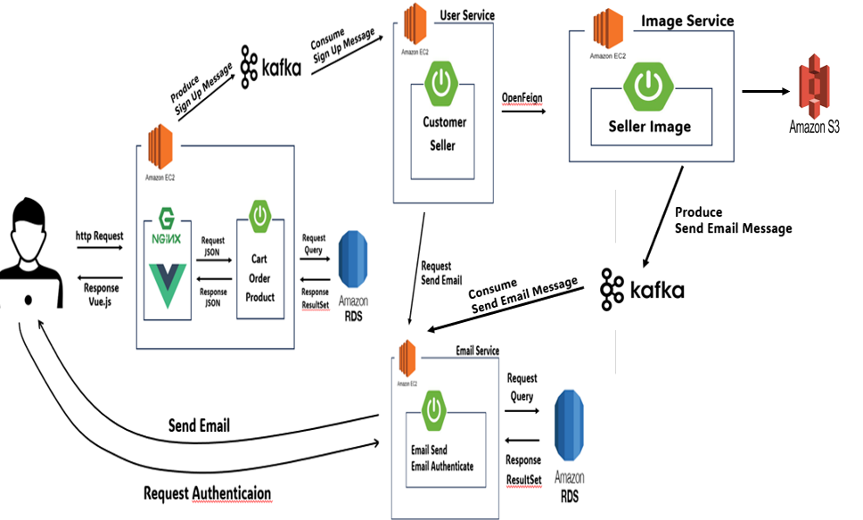

<h1 align="center">로컬 푸드 팜팜(Farmpam) 🌽 </h1>

## 🧑‍🤝‍🧑 팀원

🐯 **정동섭** 🐶 **박현범** 🐺 **양호신** 🐱 **백송연** 🐧 **김도현**

<table>
  <tbody>
    <tr>
      <td align="center"><a href="https://github.com/Hosae0905"> <b> 팀장 : 양호신</b></a> </td>
      <td align="center"><a href="https://github.com/JungDongSeob"> <b> 팀원 : 정동섭</b></a> </td>
      <td align="center"><a href="https://github.com/ParkHyeonBeom"> <b> 팀원 : 박현범</b></a> </td>
     <tr/>
      <td align="center"><a href="https://github.com/SongYeonBaek"> <b> 팀원 : 백송연</b></a> </td>
      <td align="center"><a href="https://github.com/dohyun0408"> <b> 팀원 : 김도현 </b></a> </td>
    </tr>
  </tbody>
</table>

 
 
 
 
 
 
## ✔️ 기술 스택

         
  

 
 
 
 
 
 
## 🌽 [팜팜 사이트 바로가기] 
(http://www.localfoodpam.kro.kr/)

 
 
 
 
 
 
## 👷 프로젝트 설계 
🔍 <a href="https://www.figma.com/file/iMOfyeYb7iORfHvnz3X2ET/pampam?type=design&node-id=0-1&mode=design&t=7kS13w2HbMWIC0BN-0"> 피그마 보러가기 </a>

 
 
 
 
 
 

## 💡 시스템 아키텍쳐 

 
 
 
 
## 🎥 상세 기능 (펼쳐주세요)

    
구매자 회원가입

  

    
판매자 회원가입

    
구매자 로그인

  

    
판매자 로그인

    
상품 등록

내용

    
메인 페이지

내용

    
카테고리 검색

내용

    
상품 상세 페이지

내용

    
장바구니

내용

    
결제

내용

    
결제 완료 페이지

내용

    
카테고리 검색

내용

